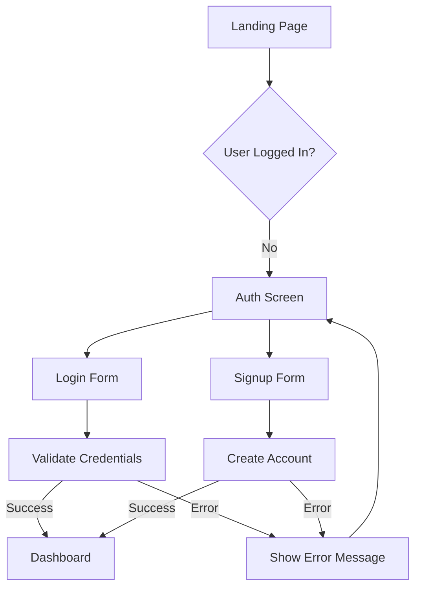
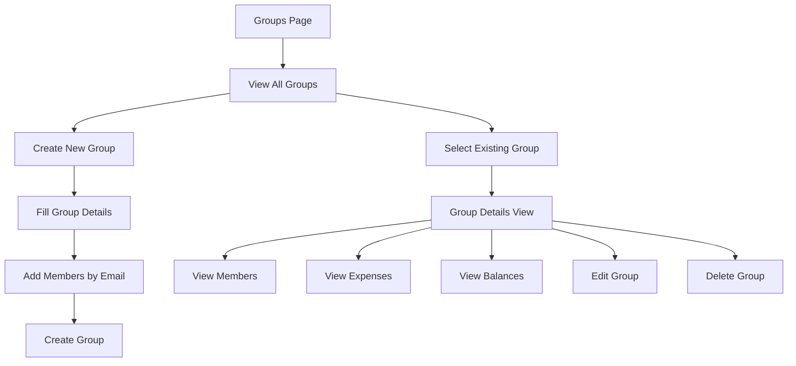
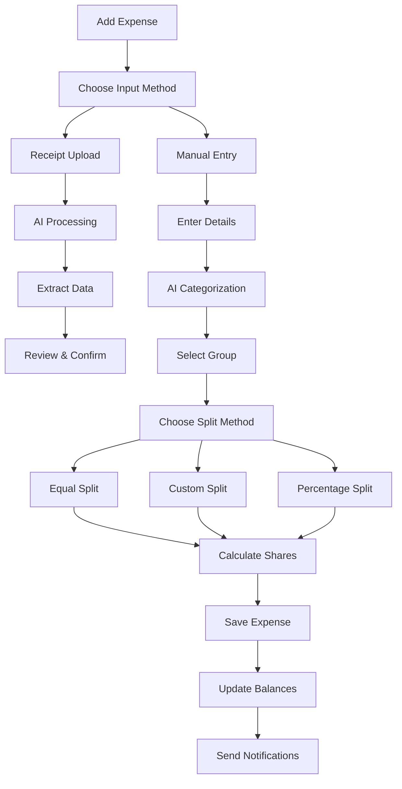
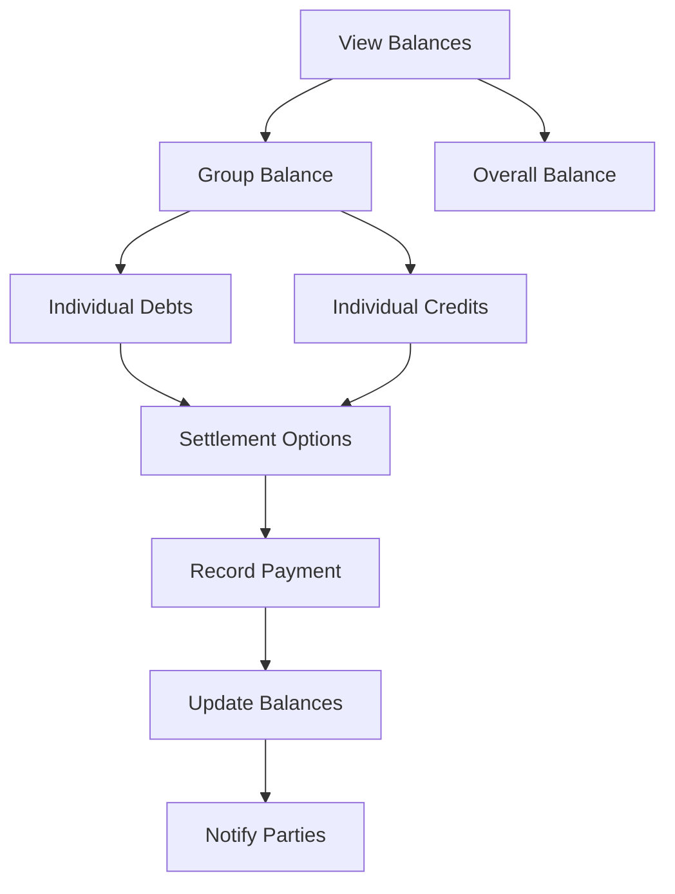
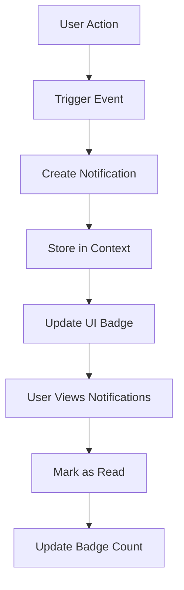

# SplitSmart - AI-Powered Expense Sharing App

<div align="center">
  
  
  [](https://bright-bonbon-42beac.netlify.app)
  [](https://reactjs.org/)
  [](https://www.typescriptlang.org/)
  [](https://tailwindcss.com/)
  [](https://www.framer.com/motion/)
</div>

## 🌟 Overview

SplitSmart is a modern, AI-powered expense sharing application designed to simplify group expense management. Built with React, TypeScript, and enhanced with beautiful animations, it offers an intuitive way to track, split, and settle expenses among friends, family, or colleagues.

### ✨ Key Features

- 🤖 **AI-Powered Receipt Scanning** - Automatically extract expense details from receipts
- 🧠 **Smart Expense Categorization** - AI suggests categories based on expense descriptions
- 👥 **Group Management** - Create and manage multiple expense groups
- 💰 **Flexible Splitting** - Equal, exact amounts, or percentage-based splits
- 📊 **Real-time Balance Tracking** - See who owes what at a glance
- 🔔 **Smart Notifications** - Stay updated on group activities
- 📱 **Responsive Design** - Works seamlessly on desktop and mobile
- 🎨 **Beautiful UI/UX** - Modern design with smooth animations
- 🌙 **Dark Theme** - Easy on the eyes with a sleek dark interface

## 🚀 Live Demo

Experience SplitSmart live: [https://bright-bonbon-42beac.netlify.app](https://bright-bonbon-42beac.netlify.app)

**Demo Credentials:**
- Email: `rahul@example.com`
- Password: `any password`

## 📸 Screenshots

### Authentication Flow
*Login and signup screens with animated backgrounds*


*Beautiful login interface with gradient animations*


*Comprehensive signup form with validation*

### Dashboard
*Overview of your financial status and recent activities*


*Interactive dashboard with balance cards and recent expenses*

### Group Management
*Create and manage expense sharing groups*


*Groups grid with member avatars and balance information*


*Detailed group view with member balances and expense history*

### AI-Powered Expense Addition
*Smart expense creation with AI assistance*


*AI-powered receipt scanner and expense categorization*


*Upload receipts for automatic data extraction*

### Expense History
*Track and review all your expenses*


*Filterable expense history with detailed breakdowns*


*Detailed expense view with split information*

### Profile & Settings
*Manage your account and preferences*


*User profile with statistics and settings*

## 🏗️ Architecture & Tech Stack

### Frontend
- **React 18.3.1** - Modern React with hooks and functional components
- **TypeScript 5.5.3** - Type-safe development
- **Tailwind CSS 3.4.1** - Utility-first CSS framework
- **Framer Motion 10.16.16** - Smooth animations and transitions
- **Lucide React** - Beautiful, customizable icons
- **React Hot Toast** - Elegant notifications

### Build Tools
- **Vite 5.4.2** - Fast build tool and development server
- **ESLint** - Code linting and quality assurance
- **PostCSS** - CSS processing with Autoprefixer

### State Management
- **React Context API** - Global state management
- **useReducer Hook** - Complex state logic handling
- **Local Storage** - Persistent user sessions

## 📱 Application Flows

### 1. Authentication Flow



**Key Features:**
- Animated login/signup forms with smooth transitions
- Form validation with real-time feedback
- Demo credentials for easy testing
- Persistent sessions using localStorage
- Beautiful error handling with toast notifications

### 2. Group Management Flow



**Key Features:**
- Visual group cards with member avatars
- Real-time balance calculations
- Member management with email invitations
- Group statistics and expense summaries
- Animated modals for create/edit/delete operations

### 3. Expense Management Flow



**Key Features:**
- AI-powered receipt scanning and data extraction
- Smart expense categorization with confidence scores
- Multiple splitting methods (equal, exact, percentage)
- Real-time split calculations
- Visual split preview with member avatars

### 4. Balance & Settlement Flow



**Key Features:**
- Real-time balance calculations
- Visual debt/credit indicators
- Settlement tracking and history
- Automatic balance updates
- Notification system for payments

### 5. Notification System Flow



**Key Features:**
- Real-time notification updates
- Categorized notification types
- Unread count badges
- Interactive notification dropdown
- Automatic read status management

## 🛠️ Installation & Setup

### Prerequisites
- Node.js 18+ 
- npm or yarn package manager

### Local Development

1. **Clone the repository**
   ```bash
   git clone <repository-url>
   cd splitsmart
   ```

2. **Install dependencies**
   ```bash
   npm install
   ```

3. **Start development server**
   ```bash
   npm run dev
   ```

4. **Open in browser**
   ```
   http://localhost:5173
   ```

### Build for Production

```bash
# Build the application
npm run build

# Preview production build
npm run preview
```

## 🎯 Usage Guide

### Getting Started

1. **Sign Up/Login**
   - Use demo credentials: `rahul@example.com` with any password
   - Or create a new account with your details

2. **Create Your First Group**
   - Navigate to Groups tab
   - Click "Create Group"
   - Add group name, description, and member emails
   - Save to create the group

3. **Add Your First Expense**
   - Go to Add Expense tab
   - Choose between manual entry or receipt upload
   - Let AI categorize your expense
   - Select the group and split method
   - Save the expense

4. **Track Balances**
   - View dashboard for overall summary
   - Check individual group balances
   - Monitor who owes what to whom

### AI Features

#### Receipt Scanning
- Upload receipt images (JPG, PNG)
- AI extracts amount, merchant, and items
- Automatic categorization with confidence scores
- Review and edit extracted data before saving

#### Smart Categorization
- Type expense description
- Click AI button for smart categorization
- Get category suggestions with reasoning
- High accuracy for common Indian expenses

### Advanced Features

#### Custom Splitting
- **Equal Split**: Divide equally among all members
- **Exact Amount**: Specify exact amounts for each person
- **Percentage**: Split by percentage shares

#### Expense Filtering
- Filter by group, category, or date range
- Search expenses by description
- View detailed expense breakdowns

## 🔧 Configuration

### Environment Variables
Currently, the app uses mock data and doesn't require external APIs. For production deployment with real backends, you would configure:

```env
VITE_API_URL=your_api_endpoint
VITE_AI_SERVICE_URL=your_ai_service_endpoint
```

### Customization

#### Themes
The app uses a dark theme by default. To customize:
- Modify Tailwind config in `tailwind.config.js`
- Update color schemes in component files
- Adjust gradient combinations for visual elements

#### Currency Support
Currently supports INR (₹) with infrastructure for:
- USD ($)
- EUR (€)
- GBP (£)

Add new currencies in `src/components/Profile.tsx`

## 🚀 Deployment

### Netlify (Recommended)
The app is optimized for Netlify deployment:

1. **Automatic Deployment**
   - Connect your GitHub repository
   - Netlify auto-detects Vite configuration
   - Builds and deploys automatically

2. **Manual Deployment**
   ```bash
   npm run build
   # Upload dist/ folder to Netlify
   ```

### Other Platforms
- **Vercel**: Works out of the box with Vite
- **GitHub Pages**: Requires base path configuration
- **Firebase Hosting**: Standard static site deployment

## 🤝 Contributing

We welcome contributions! Here's how to get started:

1. **Fork the repository**
2. **Create a feature branch**
   ```bash
   git checkout -b feature/amazing-feature
   ```
3. **Make your changes**
4. **Commit with descriptive messages**
   ```bash
   git commit -m "Add amazing feature"
   ```
5. **Push to your branch**
   ```bash
   git push origin feature/amazing-feature
   ```
6. **Open a Pull Request**

### Development Guidelines
- Follow TypeScript best practices
- Use Tailwind CSS for styling
- Maintain component modularity
- Add proper error handling
- Write descriptive commit messages

## 📝 License

This project is licensed under the MIT License - see the [LICENSE](LICENSE) file for details.

## 🙏 Acknowledgments

- **Design Inspiration**: Modern fintech applications
- **Icons**: [Lucide React](https://lucide.dev/)
- **Images**: [Pexels](https://www.pexels.com/)
- **Animations**: [Framer Motion](https://www.framer.com/motion/)
- **UI Framework**: [Tailwind CSS](https://tailwindcss.com/)

## 📞 Support

For support, questions, or feature requests:
- Create an issue on GitHub
- Email: support@splitsmart.app
- Documentation: [Wiki](https://github.com/your-repo/wiki)

## 🗺️ Roadmap

### Upcoming Features
- [ ] Real-time synchronization
- [ ] Mobile app (React Native)
- [ ] Payment gateway integration
- [ ] Advanced AI insights
- [ ] Multi-currency support
- [ ] Expense analytics and reports
- [ ] Social features and sharing
- [ ] Offline mode support

### Version History
- **v1.0.0** - Initial release with core features
- **v1.1.0** - AI-powered receipt scanning
- **v1.2.0** - Enhanced notifications system
- **v1.3.0** - Advanced splitting options

---

<div align="center">
  <p>Made with ❤️ by the SplitSmart Team</p>
  <p>
    <a href="https://bright-bonbon-42beac.netlify.app">Live Demo</a> •
    <a href="#-overview">Documentation</a> •
    <a href="#-support">Support</a>
  </p>
</div>